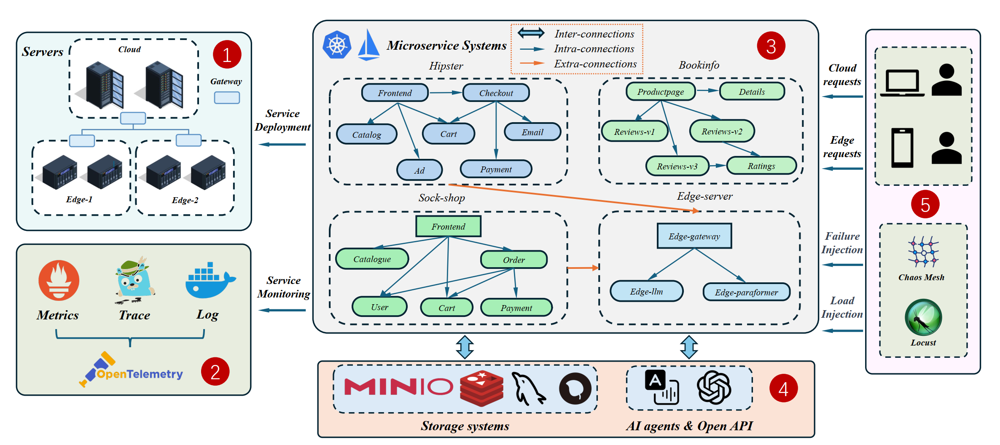

# HybridCloud
## Description

The project contains the configuration files of a benchmark of hybrid-deployed microservice systems in a cloud-edge collaborative environment.

The versions of the components in the cluster are as follows:

| Component | Version | 
|-------|-------|
| Kubernetes | v1.22.16 |
| Kuboard | v3.3.0 |
|Istio |v1.13.4|
|Jaeger |v1.52|
|Elasticsearch | v8.11.3|
|Tcpdump | v4.9.2|
|Nacos| v2.2.1|
|Etcd |v3.4.13|

## Architecture Graph

## Quick Start
### Presequisite

* Helm supported, you can see https://helm.sh/docs/helm/helm_install/ for helm install
* PVC supported, you can see https://openebs.io/docs/2.12.x/user-guides/installation for localPV support.

### 1. Build a Kubernetes cluster
We can use *kubeadm* to quickly initialise a cluster.
```shell
sudo kubeadm init --pod-network-cidr=10.244.0.0/16
                  --apiserver-advertise-address=[Master Node IP]
                  --upload-certs
                  --apiserver-cert-extra-sans=[Master Node IP]
                  --service-cidr=10.96.0.0/12
                  --image-repository registry.aliyuncs.com/google_containers
                  --kubernetes-version=v1.22.16
```
In order to add edge nodes to the cluster we need to deploy the *OpenYurt* component
```shell
helm repo add openyurt https://openyurtio.github.io/openyurt-helm

helm upgrade --install yurt-manager -n kube-system openyurt/yurt-manager

helm upgrade --install yurt-hub -n kube-system --set kubernetesServerAddr=https://1.2.3.4:6443 openyurt/yurthub

helm upgrade --install raven-agent -n kube-system openyurt/raven-agent
```
### 2. Deploy the monitor tools
```bash
make monitor-deploy
```

### 3. Deploy the microservice systems
```bash
make service-deploy
```

### Fault Injection
Using scripts to inject faults into the cluster:
* [Fault inject scrips](https://github.com/WDCloudEdge/HybridCloudConfig/tree/master/scripts/fault_inject)
